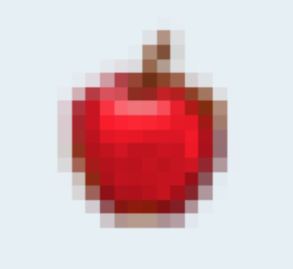

<div align="center">

</div>

# Minecraft Item Image Dataset

Welcome to the **first open-source Minecraft item image dataset**, starting with food items!

This repo is made for machine learning, computer vision, and modding experiments where you need clean, labeled images of Minecraft items. Right now, we’re focusing on food — but the goal is to eventually cover **everything** (tools, blocks, mobs, etc.).

---

## Why This Exists

Surprisingly, there’s no official image dataset for Minecraft items.

If you’ve ever tried training a classifier or doing object detection on Minecraft stuff, you probably realized the same thing: you either rip textures manually or screenshot everything yourself.

This repo fixes that — together, we’ll build a clean, structured dataset, organized and ready to go.

---

## Folder Structure

Images are organized like this:

```plaintext
dataset/
└── food/
    ├── apple/
    │   └── apple_001.jpg
    ├── golden_apple/
    │   └── golden_apple_001.jpg
    ├── carrot/
    │   └── carrot_001.jpg
    └── golden_carrot/
        └── golden_carrot_001.jpg
```

- `.jpg` format only
- Filenames follow: `itemname_001.jpg`, `itemname_002.jpg`, etc.
- Min resolution: **128×128 px** (clean, centered images preferred)

---

## Contributing

Want to help? That’s the whole point!

- Fork the repo
- Add your own images in the correct folder (or create new folders for new items)
- Follow the naming and format guidelines
- Open a pull request

Check [`CONTRIBUTING.md`](CONTRIBUTING.md) for full details.

---

## Let’s Build It Together

This is just the start.
Pull requests open. Questions welcome.

---

## License

MIT License.
